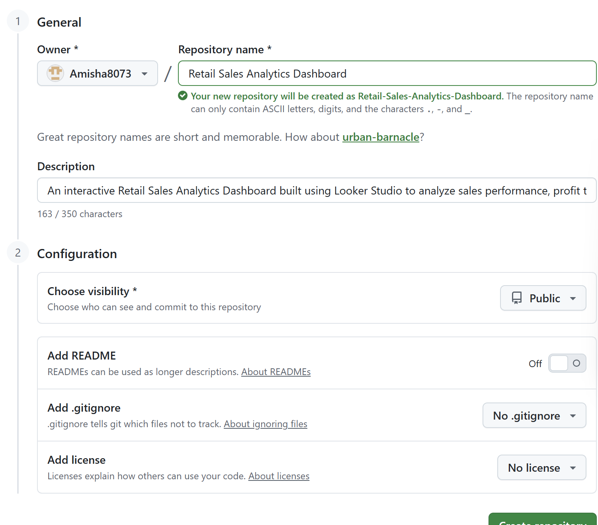

# Retail Sales Analytics Dashboard

## Project Overview
This project is an interactive Retail Sales Analytics Dashboard built using Looker Studio, SQL, and Excel to analyze business performance and generate actionable insights.

## Dashboard Features
- Revenue & Profit Analysis
- Orders by Category
- City-wise Sales Performance
- Sub-category Profit Insights
- Shipping Metrics
- Sales Trend Analysis
- Interactive Filters & Visualizations

## Tools & Technologies
- Looker Studio
- SQL
- Excel

## Dashboard Preview

## Skills Demonstrated
- Data Cleaning
- Data Transformation
- SQL Querying
- Dashboard Design
- Data Visualization
- Business Analytics

## Files Included
- DATA.xlsx
- dashboard.png
- README.md

## Author
Amisha Gupta
